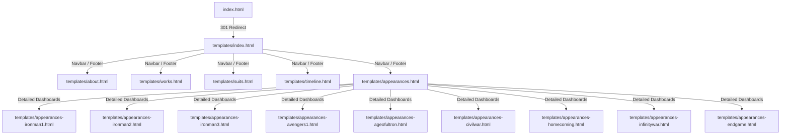

# 🌟 Tony Stark — The Iron Legacy

An interactive, premium, HUD-inspired digital portfolio and encyclopedia dedicated to the life, technologies, suits, and MCU journey of **Anthony Edward "Tony" Stark (Iron Man)**.

Built entirely using modern vanilla web technologies (HTML5, CSS3, and ES6 JavaScript) and enhanced with GreenSock (GSAP) animations, this project delivers a futuristic, high-fidelity user interface reminiscent of Stark Industries' onboard mainframes (J.A.R.V.I.S. & F.R.I.D.A.Y.).

---

## 🚀 Key Features

*   **Cinematic Stark HUD Interface**:
    *   Dynamic background particles with mouse repulsion on canvas.
    *   Authentic HUD elements (brackets, scanlines, digital grid patterns).
    *   Live system readings panel showing reactor output status, armor integrity, and GPS coordinates.
*   **Web Audio API Synth Engine**:
    *   Real-time synthesizer sounds (using sine and triangle wave oscillations) that play during search queries, menu selections, and UI expansions.
    *   Fully integrated background cinematic video with volume and audio controls.
*   **Intelligent Search Archive**:
    *   A site-wide, custom search engine capable of parsing pages, suits database, Stark inventions, and characters.
    *   Autoscan mechanism that indexed text elements directly on the active page for instantaneous local matching.
*   **Iron Man Suits Database**:
    *   Detailed catalog of armors from Mark I to Mark LXXXV.
    *   Interactive filtering based on capabilities, deployment eras, and specialized weapons.
*   **Interactive Journey Timeline**:
    *   Scroll-reveal timeline charting Tony Stark's life milestones (1970 birth, 2008 cave escape, 2012 Avengers initiation, 2023 final snap).
*   **Comprehensive Appearances Catalog**:
    *   Individual, media-rich dashboards detailing Stark’s role, key relationships, quotes, and armor details for each MCU film.

---

## 📂 Project Structure

Below is the directory mapping for the workspace. Click on any file to open it directly in the editor:

```
Tony_Stark/
│
├── index.html                       # Entry point (redirects to templates/index.html)
│
├── css/                             # Custom stylesheets
│   ├── global.css                   # Core design system tokens and resets
│   ├── components.css               # Shared HUD widgets, navbar, buttons, loaders
│   ├── home.css                     # Homepage layout, particle canvas, hero HUD
│   ├── about.css                    # Stark Industries background page styles
│   ├── appearances.css              # Movie pages list and individual dashboards layout
│   ├── works.css                    # Inventions and mainframes database page layout
│   ├── suits.css                    # Armors grid layout and modal/detail styling
│   └── timeline.css                 # Chronological story timeline track styles
│
├── js/                              # ES6 logic engines
│   ├── main.js                      # Shared scripts: Search engine, particles, page loaders, synth sounds
│   ├── home.js                      # Typewriter hero effects, video background sound settings
│   ├── about.js                     # Credentials showcase animations
│   ├── appearances.js               # Movie filters and timeline transitions
│   ├── works.js                     # Stark projects slider and description reveal triggers
│   ├── suits.js                     # Suit filtering algorithms and armor specs toggle
│   └── timeline.js                  # Scroll animations for chronological milestones
│
├── templates/                       # Page layouts
│   ├── index.html                   # Main Home dashboard template
│   ├── about.html                   # About page: background, education, and legacy
│   ├── works.html                   # Works page: Arc Reactor, AIs, and Time-Space GPS details
│   ├── suits.html                   # Suits gallery page
│   ├── timeline.html                # Timeline page
│   ├── appearances.html             # Appearances archive list
│   │
│   # Detailed MCU appearances dashboards
│   ├── appearances-ironman1.html
│   ├── appearances-ironman2.html
│   ├── appearances-ironman3.html
│   ├── appearances-avengers1.html
│   ├── appearances-ageofultron.html
│   ├── appearances-civilwar.html
│   ├── appearances-homecoming.html
│   ├── appearances-infinitywar.html
│   └── appearances-endgame.html
│
└── source/                          # Visual and media assets (video background, graphics, posters)
```

### 🔗 Key Code Links
*   Redirect Landing Page: [index.html](./index.html)
*   Main HUD Dashboard: [templates/index.html](./templates/index.html)
*   Design Tokens: [css/global.css](./css/global.css)
*   Shared Web UI Components: [css/components.css](./css/components.css)
*   Global Scripts & Sound Engine: [js/main.js](./js/main.js)
*   Armor Detail Controller: [js/suits.js](./js/suits.js)

---

## 🗺️ Navigation & Architecture

The website uses a flat, fast-redirect page flow. The relationship between templates is shown below:



---

## 🎨 Design System

The application relies on CSS custom properties (variables) defined in [css/global.css](./css/global.css) to build a unified Stark HUD look and feel:

### Design Tokens
| Category | Token Variable | Value |
| :--- | :--- | :--- |
| **Primary Theme Red** | `--arc-blue` | `#e62429` (Iron Man Red) |
| **Accent Gold** | `--stark-gold` | `#f0c040` (Stark Gold) |
| **Primary Background** | `--bg-primary` | `#0a0a0f` (Deep Charcoal) |
| **Secondary Background**| `--bg-secondary` | `#12121a` |
| **Card Glass Background** | `--bg-glass` | `rgba(18, 18, 26, 0.75)` |
| **Heading Font** | `--font-heading` | `'Orbitron', sans-serif` |
| **Body Font** | `--font-body` | `'Rajdhani', sans-serif` |
| **HUD Monospace Font** | `--font-mono` | `'Share Tech Mono', monospace` |

### Typography Hierarchy
*   `h1`: Fluid Hero Title size (`--fs-hero`)
*   `h2`: Section Headers size (`--fs-2xl`)
*   `h3`: Subheadings size (`--fs-xl`)
*   `h4` / `h5` / `h6`: Card headers and labels (`--fs-lg`, `--fs-md`, `--fs-base`)
*   `p` / `body`: Body copies (`--fs-base`)

---

## ⚙️ Tech Stack & Dependencies

1.  **HTML5**: Semantic layout markup using HTML5 blocks (`<nav>`, `<section>`, `<article>`, `<footer>`).
2.  **CSS3 Grid & Flexbox**: Fully responsive grids and layout columns without external utility frameworks (like Tailwind).
3.  **Vanilla ES6 JavaScript**: High-performance DOM manipulation, event list listeners, custom filtering, and page navigation calculations.
4.  **Web Audio API**: Real-time synthesizer engine mapping frequency oscillators to click/hover animations.
5.  **GreenSock (GSAP)**: Used for high-fidelity stagger animations on headings, subtitles, and navigation menus.
6.  **Intersection Observer API**: Enables lazy-reveal effects on scroll for timeline items, cards, and text content blocks.

---

## 🛠️ How to Run Locally

Since this is a fully static project, it does not require any backend database or build compilation steps. You can run it instantly using any of the following methods:

### Method 1: File Explorer (Direct Run)
1. Navigate to the project root directory.
2. Double-click the [index.html](./index.html) file to launch it in your default web browser.

### Method 2: Live Server (VS Code Extension)
1. Open the project folder in VS Code.
2. Click **Go Live** in the status bar (requires the "Live Server" extension).

### Method 3: Simple Python Server
If you have Python installed, open your command terminal inside the project root directory and run:
```bash
python -m http.server 8000
```
Then, navigate to `http://localhost:8000/` in your web browser.

### Method 4: Node.js http-server
If you have Node.js installed, run:
```bash
npx http-server ./ -p 8080
```
Then, navigate to `http://localhost:8080/` in your web browser.

---

## 🛸 System Commands & Controls

*   **Audio Toggle**: Look for the speaker icon in the bottom-right corner of the homepage to mute/unmute the cinematic background video.
*   **Search Console**: Click the search icon in the top-right corner of the navbar or press any key inside the input area to query the archives. Press `Esc` to close the HUD search dropdown.
*   **Back to Top**: A floating repulsor icon appears when scrolling down, offering instant viewport reset on click.
